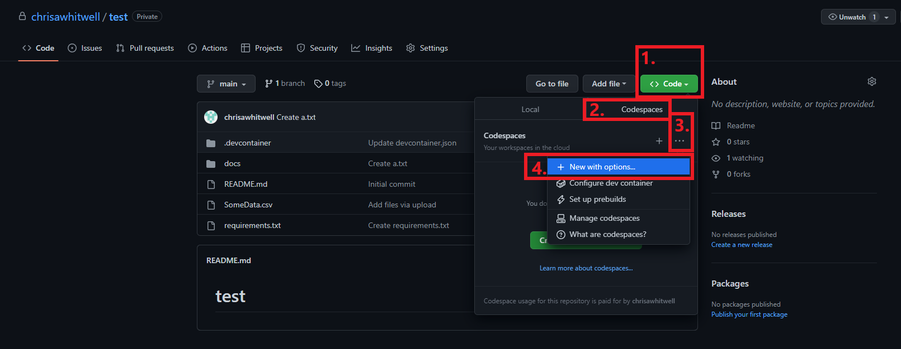

# Test Assignment Repository

## Steps
1. [Fork](https://docs.github.com/en/get-started/quickstart/fork-a-repo#forking-a-repository) this repository to your own account
2. Once in your own repository (i.e. your-user-name/repository-name), click "<> Code", then "Codespaces", then the three horizontal grey dots (hover will show "Codespace repository configuration"), and finally "+  New with options".

3.
